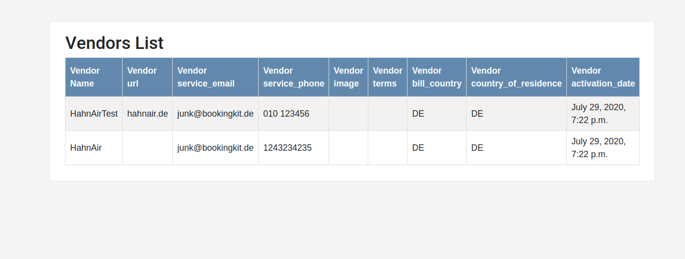

#### Here it Goes


#### HOW TO USE THE APPLICATION For Above Results

#####OPTION #1  Very Easy "RUN APP WITH ALREADY BUILT DOCKER IMAGE"

```sh 
#1 docker pull 614623444951.dkr.ecr.us-east-1.amazonaws.com/hanah:latest
#2 docker run --publish 8000:8000 -it 614623444951.dkr.ecr.us-east-1.amazonaws.com/hanah:latest
```

##### OPTION #2 Want TO TRY Yourself building it, then checkout the code from https://github.com/shafeequ/hanah

```
1 - "cd" to project directory where Dockerfile is
2 - Run "docker build -t hanah ."
3 - Run "docker run --publish 8000:8000 -it hanah"
4 - Go to browser and enter "http://0.0.0.0:8000/"
```

##### OPTION #3 Setup Everything manually
```
1 - Create a virtual environment using "virtualenv" or python3 builtin venv module (python3 -m venv myenv)
2 - Activate that environment ". myenv/bin/activate"
3 - "cd" to the project root where "requirements.txt" is that is cd projectmain/
4 - Run "pip install -r requirements.txt", this will install all dependencies for the project
5 - Run python manage.py makemigrations && python manage.py migrate
6 - Run "python manage.py runserver 8000"
7 - Goto to your browser and type "http://127.0.0.1:8000/".. Voila!
```

 
